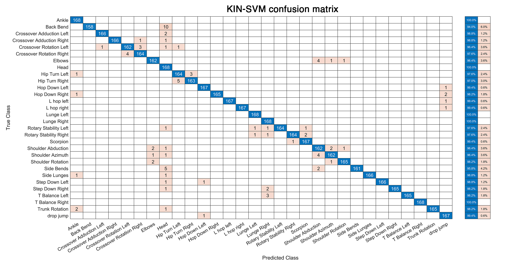

# Kinectome4MovementRecognition
---
This repository contains the code and supporting documents associated with the following manuscript:

**- Please note: the manuscript is under review - the script (but not the figures) will be promptly updated accordin to the revision.**
**- To date, the script includes analysis with UMAP too (which are not part of the preprint version) - Figures, descriptions and link to the peer-reviewed version of the manuscript will be updated once the manuscript is published.**

- OA access: https://doi.org/10.1101/2025.02.27.640538
Please cite as:

Troisi Lopez, E., Minino, R., De Luca, M., Tafuri, F., Sorrentino, G., Sorrentino, P., & Corsi, M. C. (2025). Artificial Intelligence for automatic movement recognition: a network-based approach. bioRxiv, 2025-02.

---
## Authors:
* Emahnuel Troisi Lopez, Department of Education and Sport Sciences, Pegaso Telematic University, 80143, Naples, Italy
* Roberta Minino, Department of Education and Sport Sciences, Pegaso Telematic University, 80143, Naples, Italy
* Mario De Luca, Department of Medical, Motor and Wellness Sciences, University of Naples “Parthenope”, 80133 Napoli, Italy
* Francesco Tafuri, Heracle Lab Research in Educational Neuroscience, Niccolò Cusano University, 00166 Rome, Italy
* Giuseppe Sorrentino, Department of Economics, Law, Cybersecurity and Sports Sciences, University of Naples “Parthenope”, 80035 Nola, Italy
* Pierpaolo Sorrentino, Aix Marseille University, INSERM, INS, Institut de Neurosciences des Systèmes, 13007, Marseille, France
* Marie-Constance Corsi, Sorbonne Université, Institut du Cerveau—Paris Brain Institute—ICM, CNRS, Inria, Inserm, AP-HP, Hôpital de la Pitié Salpêtrière, F-75013 Paris, France

---
## Abstract
Automatic movement recognition is often used to support various fields such as clinical, sports, and security. To date, there is a lack of a classification feature that is both interpretable and not movement-specific. Previous studies on motion analysis have shown that coordination properties extracted using network theory can describe specific movement characteristics, making coordination a potential feature for classification. Hence, we leveraged kinematic data from 168 individuals performing 30 different movements, published in an online dataset and compared features extracted using network theory (kinectomes) to the ones extracted using principal component analysis (PCA). The classification accuracy of the kinectome (0.99 ± 0.01) was significantly higher (p < 0.001) than that of PCA (0.96 ± 0.04), but not significantly different from UMAP (0.98 ± 0.02, p = 0.314). Our results show that both kinectome- and UMAP-based features achieve high classification accuracy. However, kinectomes provide the key advantage of interpretability, enabling anatomically and functionally meaningful insights into movement patterns.

---
## Data
The data on which the analyses in the manuscript are based were published by Zhao et al. and are publicly available on [Science Data](https://doi.org/10.1038/s41597-023-02082-6) here:
[https://www.nature.com/articles/s41597-023-02082-6](https://www.nature.com/articles/s41597-023-02082-6)
Zhao, X., Ross, G., Dowling, B. et al. Three-Dimensional Motion Capture Data of a Movement Screen from 183 Athletes. Sci Data 10, 235 (2023). https://doi.org/10.1038/s41597-023-02082-6

## Code
This repository contains the MATLAB code used to run the classification analysis performed and to plot the main figure of the paper.
The data contained in the dataset cannot be directly used with this code, as they were first subjected to steps of visual inspection, removal of poor-quality data, and preprocessing, as described in the manuscript.
The way the data should be organized in matlab is reported in the main function 'movement_classification_kinectome_vs_PCA' 
You can run the code calling this function as:
`T = movement_classification_kinectome_vs_PCA(data, labels)`

---
## Figures

### Figure 1 - Analysis Pipeline 

*Generic view.*

### Figure 2 - Classification accuracy comparison

*Classification was performed via support vector machine (SVM), using features extracted using principal component analysis (PCA-SVM) and kinematic network analysis (KIN-SVM), separately. Each dot represents the accuracy score of each movement, averaged across 50 splits of cross-validation. KIN-SVM showed significantly higher classification accuracy than PCA-SVM (pFDR < 0.001).*

### Figure S1 - Confusion matrix - Kinectome

*Confusion matrix of support vector machine classification based on kinectomes*

### Figure S2 - Confusion matrix - PCA

*Confusion matrix of support vector machine classification based on principal component analysis (PCA).*
